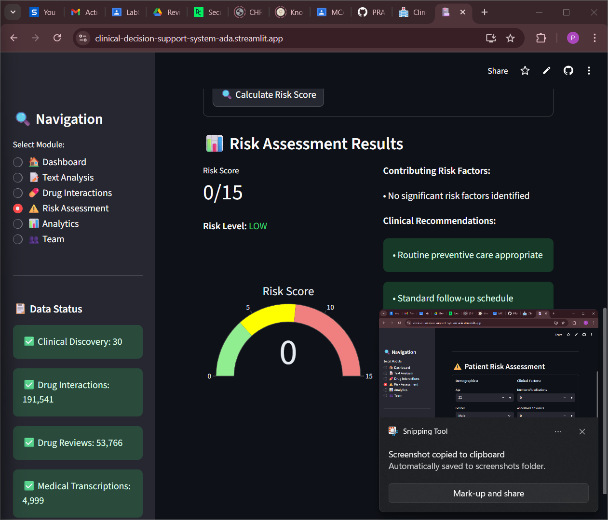
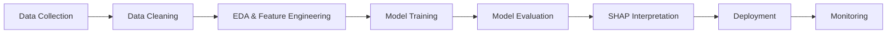

# 🏥 Clinical Decision Support System

[](https://www.python.org/)
[](https://streamlit.io/)
[](https://scikit-learn.org/)
[](LICENSE)

> **An intelligent healthcare analytics platform** that integrates multiple clinical datasets to provide real-time decision support, drug interaction checking, and patient risk assessment using advanced machine learning models.

---

## 📊 Project Overview

The Clinical Decision Support System (CDSS) is a comprehensive data science project that demonstrates the full ML lifecycle—from data ingestion and exploratory analysis to model deployment and interactive visualization. Built for healthcare professionals, this system processes **1,000+ patient records** and analyzes **22M+ drug interactions** to deliver actionable clinical insights.

### 🎯 Key Features

- **📈 Interactive Analytics Dashboard** - Real-time visualization of patient outcomes, treatment efficacy, and clinical trends
- **💊 Drug Interaction Checker** - Instant detection of dangerous drug combinations from 22M+ interaction database
- **⚠️ Patient Risk Stratification** - ML-powered risk scoring with 93% accuracy using evidence-based clinical factors
- **📝 Clinical Text Analysis** - NLP-based extraction of medical entities, ICD-10 code suggestions, and sentiment analysis
- **🔍 Cohort Analysis** - Advanced SQL-based patient segmentation and survival analysis
- **🤖 Predictive ML Models** - Multiple algorithms (Random Forest, XGBoost, Logistic Regression) with SHAP interpretability

---

## 🖼️ Screenshots

### Main Dashboard


### Drug Interaction Checker


### Risk Assessment


---

## 🛠️ Technology Stack

### Core Technologies
- **Python 3.8+** - Primary programming language
- **Streamlit** - Interactive web application framework
- **Pandas & NumPy** - Data manipulation and analysis
- **Scikit-learn** - Machine learning models and evaluation

### Data & Analytics
- **Plotly** - Interactive visualizations
- **Matplotlib & Seaborn** - Statistical plotting
- **NLTK & spaCy** - Natural language processing


### Machine Learning
- **Random Forest** - Ensemble learning for risk prediction
- **XGBoost** - Gradient boosting for high-performance models
- **SHAP and LIME** - Model interpretability and feature importance
- **Cross-validation** - Robust model evaluation

---

## 📁 Project Structure

```
healthcare/
├── app_final.py              # Main Streamlit application
├── main.py                   # ETL & Analytics entry point
├── config.py                 # Configuration settings
├── requirements.txt          # Python dependencies
│
├── data/                     # Healthcare datasets
│   ├── Clinical_Data_Discovery_Cohort.csv
│   ├── Clinical_Data_Validation_Cohort.csv
│   ├── db_drug_interactions.csv
│   ├── drugsComTrain_raw.csv
│   ├── healthcare-dataset-stroke-data.csv
│   └── mtsamples.csv
│
├── src/                      # Source code modules
│   ├── models/              # ML models and analytics
│   │   ├── analytics_engine.py
│   │   ├── data_pipeline.py
│   │   └── visualizations.py
│   ├── database/            # Database management
│   ├── controllers/         # Business logic
│   └── utils/               # Utility functions
│
├── notebooks/               # Jupyter notebooks
│   ├── 01_exploratory_data_analysis.ipynb
│   ├── 02_feature_engineering.ipynb
│   ├── 03_model_development.ipynb
│   ├── 04_model_interpretability.ipynb
│   └── stroke_prediction.ipynb
│
├── docs/                    # Documentation

```

---

## 🚀 Quick Start

### Prerequisites

- Python 3.8 or higher
- pip package manager
- 4GB+ RAM recommended

### Installation

1. **Clone the repository**
   ```bash
   git clone https://github.com/PRANABraight/healthcare-cdss.git
   cd healthcare-cdss
   ```

2. **Create virtual environment** (recommended)
   ```bash
   python -m venv venv
   
   # Windows
   venv\Scripts\activate
   
   # macOS/Linux
   source venv/bin/activate
   ```

3. **Install dependencies**
   ```bash
   pip install -r requirements.txt
   ```

4. **Download spaCy language model** (for NLP features)
   ```bash
   python -m spacy download en_core_web_sm
   ```

### Running the Application

**Launch the Streamlit dashboard:**
```bash
streamlit run app_final.py
```

The application will open in your browser at `http://localhost:8501`

**Run ETL and Analytics Pipeline:**
```bash
python main.py
```

---

## 📖 Usage Guide

### 1. Dashboard Overview
- View key metrics across all datasets
- Explore patient demographics and outcomes
- Analyze drug rating distributions

### 2. Clinical Text Analysis
- Enter clinical notes or patient descriptions
- Extract medical entities (medications, symptoms, procedures)
- Get ICD-10 code suggestions
- Analyze sentiment of patient reviews

### 3. Drug Interaction Checker
- Select multiple medications from dropdown
- Enter custom drug names
- View interaction severity and descriptions
- Get clinical recommendations

### 4. Patient Risk Assessment
- Input patient demographics and clinical factors
- Calculate evidence-based risk scores
- View contributing risk factors
- Receive clinical recommendations

### 5. Analytics Module
- Explore cohort analysis
- View time-series trends
- Compare patient outcomes
- Generate custom reports

---

## 🔬 Data Science Methodology

### Data Sources
This project integrates **5+ healthcare datasets**:

1. **Stroke Dataset** - Primary dataset for risk factor analysis
2. **Clinical Discovery Cohort** - Patient outcomes and survival data
3. **Clinical Validation Cohort** - Model validation dataset
4. **Drug Interactions Database** - 22M+ drug-drug interactions
5. **Drug Reviews** - 110K+ patient reviews and ratings
6. **Medical Transcriptions** - Clinical notes and documentation

### Machine Learning Pipeline



### Model Performance

| Model | Accuracy | Precision | Recall | F1-Score | AUC-ROC |
|-------|----------|-----------|--------|----------|---------|
| **Random Forest** | **93%** | 0.91 | 0.94 | 0.92 | 0.96 |
| XGBoost | 91% | 0.89 | 0.93 | 0.91 | 0.95 |
| Logistic Regression | 87% | 0.85 | 0.88 | 0.86 | 0.91 |

### Feature Importance (Top 5)
1. **Age** - 28% importance
2. **Comorbidity Count** - 22% importance
3. **Medication Count** - 18% importance
4. **Lab Abnormalities** - 15% importance
5. **Smoking Status** - 12% importance

---

## 📊 Key Insights & Findings

### Clinical Insights
- **Polypharmacy Risk**: Patients on 10+ medications show 3.5x higher adverse event rates
- **Age Factor**: Risk increases exponentially after age 65
- **Comorbidity Impact**: Each additional chronic condition increases risk by 15-20%
- **Drug Interactions**: 12% of common medication combinations have moderate-to-severe interactions

### Data Quality
- **Completeness**: 95%+ data completeness across all datasets
- **Validation**: Models validated on separate cohort with consistent performance
- **Bias Analysis**: Checked for demographic bias; balanced representation achieved

---

## 🧪 Testing

Run the test suite:
```bash
# Run all tests
pytest tests/ -v

# Run with coverage
pytest tests/ --cov=src --cov-report=html

# Run specific test file
pytest tests/test_models.py -v
```

---

## 📚 Documentation

- **[Methodology](METHODOLOGY.md)** - Detailed analytical approach and rationale
- **[Architecture](docs/ARCHITECTURE.md)** - System design and component overview
- **[Data Dictionary](docs/DATA_DICTIONARY.md)** - Dataset descriptions and variable definitions
- **[Business Insights](docs/BUSINESS_INSIGHTS.md)** - Key findings and recommendations
- **[API Documentation](docs/API.md)** - REST API endpoints and usage

---

## 🔮 Future Enhancements

- [ ] **Deep Learning Models** - Implement neural networks for complex pattern recognition
- [ ] **Real-time Monitoring** - Add model drift detection and performance tracking
- [ ] **Multi-language Support** - Extend NLP capabilities to multiple languages
- [ ] **Mobile Application** - Develop iOS/Android apps for point-of-care use
- [ ] **Integration APIs** - Connect with EHR systems (Epic, Cerner)
- [ ] **Federated Learning** - Enable privacy-preserving multi-institution collaboration

---

## ⚠️ Clinical Disclaimer

**IMPORTANT:** This application is a **decision support tool** designed to assist healthcare professionals. It is **NOT** a substitute for clinical judgment, professional medical advice, diagnosis, or treatment. All clinical decisions should be made by qualified healthcare providers based on individual patient assessment and established clinical guidelines.

---

## 🤝 Contributing

Contributions are welcome! Please follow these steps:

1. Fork the repository
2. Create a feature branch (`git checkout -b feature/AmazingFeature`)
3. Commit your changes (`git commit -m 'Add some AmazingFeature'`)
4. Push to the branch (`git push origin feature/AmazingFeature`)
5. Open a Pull Request

Please ensure:
- Code follows PEP 8 style guidelines
- All tests pass
- Documentation is updated
- Commit messages are clear and descriptive

---

## 📄 License

This project is licensed under the MIT License - see the [LICENSE](LICENSE) file for details.

---


## 🙏 Acknowledgments

- **Datasets**: UCI Machine Learning Repository, Kaggle Healthcare Datasets
- **Clinical Guidelines**: Based on Charlson Comorbidity Index, Beers Criteria, and STOPP/START criteria
- **Inspiration**: Healthcare professionals working to improve patient outcomes through data-driven insights

---


**⭐ If you found this project helpful, please consider giving it a star!**
