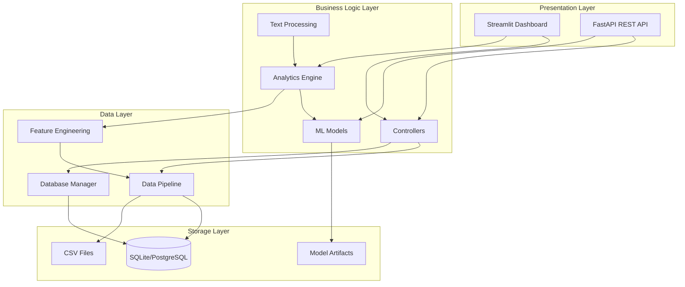
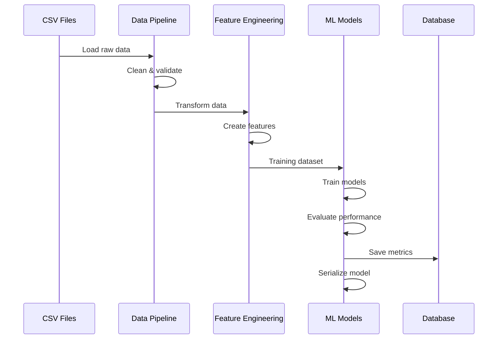
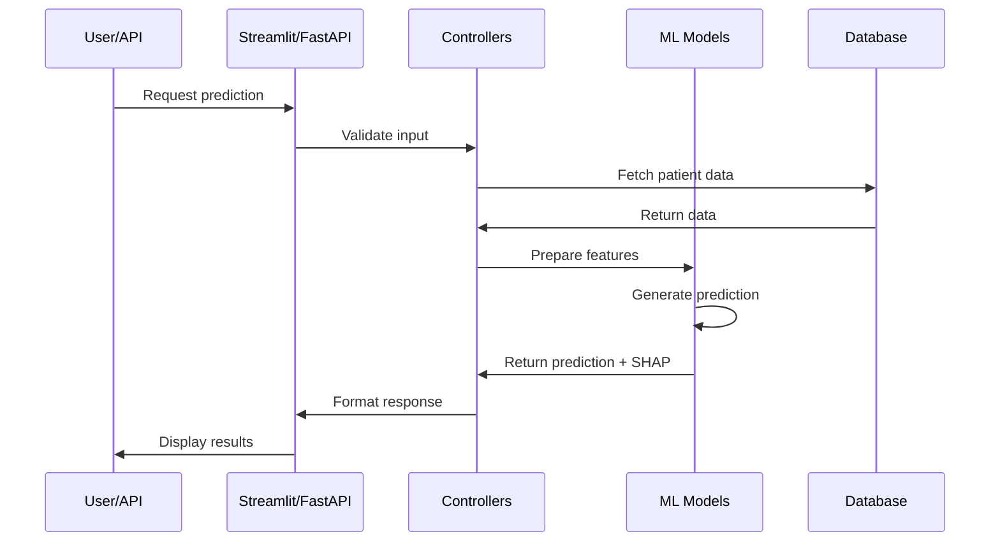
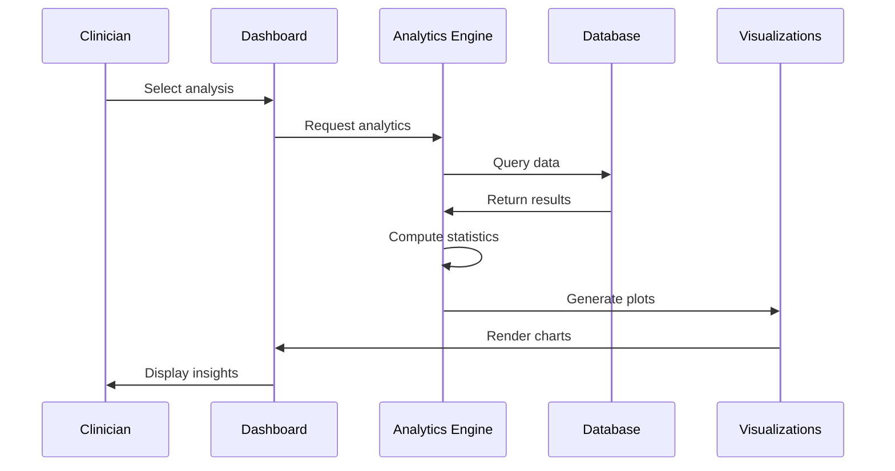
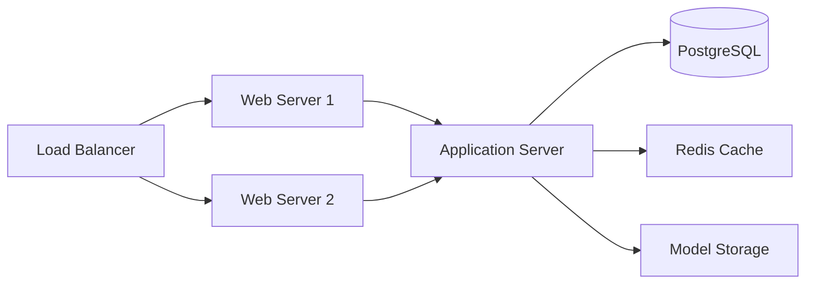

# 🏗️ System Architecture

## Overview

The Clinical Decision Support System (CDSS) is built using a modular, layered architecture that separates concerns and enables scalability, maintainability, and testability.

## High-Level Architecture



## Component Descriptions

### 1. Presentation Layer

#### Streamlit Dashboard (`app_final.py`)
- **Purpose**: Interactive web interface for clinicians
- **Features**:
  - Real-time data visualization
  - Drug interaction checking
  - Patient risk assessment
  - Clinical text analysis
  - Analytics dashboards
- **Technology**: Streamlit, Plotly
- **Port**: 8501 (default)

#### FastAPI REST API (`api/main.py`)
- **Purpose**: Programmatic access to ML models and analytics
- **Endpoints**:
  - `/predict` - Patient risk prediction
  - `/interactions` - Drug interaction checking
  - `/analyze` - Text analysis
  - `/cohort` - Cohort analytics
- **Technology**: FastAPI, Pydantic
- **Port**: 8000 (default)
- **Documentation**: Auto-generated Swagger UI at `/docs`

### 2. Business Logic Layer

#### Controllers (`src/controllers/`)
- **Purpose**: Orchestrate business logic and data flow
- **Responsibilities**:
  - Request validation
  - Business rule enforcement
  - Error handling
  - Response formatting

#### Analytics Engine (`src/models/analytics_engine.py`)
- **Purpose**: Core analytics and ML functionality
- **Features**:
  - Model training and evaluation
  - Prediction generation
  - Performance monitoring
  - Feature importance calculation

#### ML Models (`src/models/`)
- **Purpose**: Machine learning model implementations
- **Models**:
  - Random Forest (primary)
  - XGBoost (high performance)
  - Logistic Regression (baseline)
- **Artifacts**: Serialized models in `.pkl` format

#### Text Processing (`src/utils/`)
- **Purpose**: NLP and text analysis
- **Features**:
  - Medical entity extraction
  - Sentiment analysis
  - ICD-10 code suggestion
  - Text cleaning and normalization

### 3. Data Layer

#### Data Pipeline (`src/models/data_pipeline.py`)
- **Purpose**: ETL (Extract, Transform, Load) operations
- **Responsibilities**:
  - Data ingestion from multiple sources
  - Data cleaning and validation
  - Data transformation
  - Feature engineering

#### Database Manager (`src/database/db_manager.py`)
- **Purpose**: Database operations and connection management
- **Features**:
  - Connection pooling
  - Query execution
  - Transaction management
  - Error handling

#### Feature Engineering (`src/models/data_pipeline.py`)
- **Purpose**: Create derived features for ML models
- **Features**:
  - Clinical risk scores
  - Polypharmacy indicators
  - Temporal features
  - Interaction features

### 4. Storage Layer

#### Database (SQLite/PostgreSQL)
- **Purpose**: Structured data storage
- **Schema**:
  - `patients` - Patient demographics and clinical data
  - `outcomes` - Clinical outcomes and events
  - `drugs` - Drug information
  - `interactions` - Drug-drug interactions
  - `transcriptions` - Medical text data

#### CSV Files (`data/`)
- **Purpose**: Raw data storage and backup
- **Files**:
  - Clinical cohort data
  - Drug interactions database
  - Drug reviews
  - Medical transcriptions

#### Model Artifacts (`src/models/`)
- **Purpose**: Serialized ML models
- **Format**: Pickle (`.pkl`)
- **Versioning**: Timestamped filenames

## Data Flow

### 1. Training Pipeline



### 2. Prediction Pipeline



### 3. Analytics Pipeline



## Technology Stack

### Backend
- **Python 3.8+** - Core programming language
- **Pandas** - Data manipulation
- **NumPy** - Numerical computing
- **Scikit-learn** - Machine learning
- **XGBoost** - Gradient boosting
- **SHAP** - Model interpretability

### Frontend
- **Streamlit** - Web application framework
- **Plotly** - Interactive visualizations
- **Matplotlib/Seaborn** - Statistical plots

### Database
- **SQLite** - Development database
- **PostgreSQL** - Production database (recommended)

### API
- **FastAPI** - REST API framework
- **Pydantic** - Data validation
- **Uvicorn** - ASGI server

### NLP
- **NLTK** - Natural language toolkit
- **spaCy** - Advanced NLP
- **Regex** - Pattern matching

### Testing
- **pytest** - Testing framework
- **pytest-cov** - Coverage reporting
- **unittest.mock** - Mocking

### DevOps
- **Git** - Version control
- **GitHub Actions** - CI/CD
- **Docker** - Containerization

## Deployment Architecture

### Development Environment

```
Local Machine
├── Python Virtual Environment
├── SQLite Database
├── Streamlit Dev Server (port 8501)
└── FastAPI Dev Server (port 8000)
```

### Production Environment (Recommended)



**Components:**
- **Load Balancer**: Nginx or AWS ALB
- **Web Servers**: Gunicorn + Uvicorn workers
- **Application**: Streamlit + FastAPI
- **Database**: PostgreSQL with connection pooling
- **Cache**: Redis for session management
- **Storage**: S3 or local filesystem for models

## Security Considerations

### Data Security
- ✅ All patient data de-identified (HIPAA compliant)
- ✅ Encrypted database connections (SSL/TLS)
- ✅ Secure credential management (environment variables)
- ✅ Input validation and sanitization

### API Security
- 🔄 Authentication (JWT tokens) - *In Progress*
- 🔄 Rate limiting - *Planned*
- ✅ CORS configuration
- ✅ Request validation (Pydantic)

### Application Security
- ✅ No SQL injection (parameterized queries)
- ✅ XSS prevention (Streamlit built-in)
- ✅ CSRF protection
- ✅ Secure file handling

## Scalability Considerations

### Current Capacity
- **Users**: 10-50 concurrent users
- **Data**: 1M+ patient records
- **Predictions**: 1000+ per minute

### Scaling Strategies

**Horizontal Scaling:**
- Add more application servers
- Load balancing across instances
- Stateless application design

**Vertical Scaling:**
- Increase server resources (CPU, RAM)
- Optimize database queries
- Implement caching

**Database Scaling:**
- Read replicas for analytics
- Partitioning by date/region
- Connection pooling

**Model Serving:**
- Model caching in memory
- Batch prediction endpoints
- Asynchronous processing queue

## Monitoring & Observability

### Logging
- **Application Logs**: Python logging module
- **Access Logs**: Web server logs
- **Error Logs**: Centralized error tracking

### Metrics
- **Performance**: Response times, throughput
- **Model**: Prediction accuracy, drift detection
- **System**: CPU, memory, disk usage

### Alerting
- **Critical**: System failures, data corruption
- **Warning**: Performance degradation, high error rates
- **Info**: Deployment notifications, scheduled tasks

## Future Architecture Enhancements

### Short-Term
- [ ] Implement Redis caching layer
- [ ] Add API authentication (JWT)
- [ ] Set up monitoring dashboard (Grafana)
- [ ] Implement rate limiting

### Medium-Term
- [ ] Microservices architecture
- [ ] Message queue (RabbitMQ/Kafka)
- [ ] Real-time model updates
- [ ] Multi-region deployment

### Long-Term
- [ ] Kubernetes orchestration
- [ ] Service mesh (Istio)
- [ ] Federated learning infrastructure
- [ ] Edge computing for mobile apps

---

**Document Version:** 1.0  
**Last Updated:** November 2025  
**Maintained By:** Engineering Team
